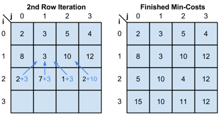

# Seam Carving

## *Project Title* - Implementation of *Seam Carving* for image retargeting using CUDA enabled GPU

[![Build Status][travis-image]][travis-url]

## Problem Definition

To implement **content-aware [Seam Carving Algorithm](https://en.wikipedia.org/wiki/Seam_carving)** of image processing (which is used by Adobe Photoshop) using a **sequential** and a **parallel** approach. The sequential implementation will be done on a CPU (Central processing units) and the parallel implementation will be done on a [CUDA (Compute unified device architecture)](https://en.wikipedia.org/wiki/CUDA) powered NVidia [GPU](https://en.wikipedia.org/wiki/Graphics_processing_unit). 

*The primary purpose of this demonstration is to show the difference between the computational speeds of a CPU and a GPU.* 

## Introduction

### What is Seam Carving?

From Wikipedia :

>**Seam carving is an algorithm for image resizing**, developed by Shai Avidan, of Mitsubishi
Electric Research Laboratories (MERL), and Ariel Shamir, of the Interdisciplinary Center and MERL. It
functions by establishing a number of seams (paths of least importance) in an image and **automatically
removes seams to reduce image size or inserts seams to extend it.** Seam carving also allows manually
defining areas in which pixels may not be modified, and **features the ability to remove whole objects from
photographs.** 
>
>*The purpose of the algorithm is to display images without distortion on various media (cell
phones, PDAs) using document standards, like HTML, that already support dynamic changes in page
layout and text, but not images.*

For detail explanation check this [video](https://youtu.be/6NcIJXTlugc).

### What is a seam?

From Wikipedia :

>Seams can be either vertical or horizontal. **A vertical seam is a path of connected pixels from top
to bottom in an image with one pixel in each row.** A horizontal seam is similar with the exception of the
connection being from left to right. The importance/energy function values a pixel by measuring its
contrast with its neighbor pixels.

### Why Seam Carving?

Effective resizing of images should not only use geometric constraints, but consider the image content as well. 
Conventional image resizing consists of **cropping** or evenly **down sampling** that *lead to loss of important features or distortion.* 
Whereas on the other hand seam carving method enables us to remove pixel from uninteresting parts of the image while preserving important content.

As seen in above Figure We can clearly notice that Seam carving method preserves the interesting features of the image (here castle and person) when resized the image. 
On the contrary Scaling introduces geometric distortion And Cropping resulted in loss of important features of the
image (person on the left).

>Seam carving can be used for distortion free image expansion by inserting least energy seams in
the image. This can also be extended to object removal and object protection in an image.

### What is CUDA?

CUDA (Compute Unified Device Architecture) is an open parallel architecture, introduced in 2007, developed by Nvidia.
It is a computational drive, which is used in graphics processors, and is accessible to software developers through the standard programming languages. 
It mainly uses C as an extensing language for CUDA, along with other languages such as Perl, Python, Java, Fortran and Matlab environment. 

*CUDA gives developers access to a limited set of command and GPU resources.* 
CUDA exploits the potential of the powerful graphics processing units in modern computers. 
**The main difference in the architecture of CPU and GPU is in the proportion of transistors that they designed with, as well as the number of tasks that they can perform in parallel.**

The orange color is highlighted memory part, to control yellow, and green represents arithmetical logical part of the process unit.

### How CUDA works?

The operation is divided into four phases:

1. Transfer of data from main memory to GPU memory
2. CPU commands GPU to perform the task
3. Graphics processing unit processes the data
4. Transfer of data from GPU memory to main memory

### CUDA programming model

Software code written for CUDA system is divided into two units, the parallel and the serial code.
- The serial code is carried out on the CPU and contains mainly commands to transfer data to the GPU and vice versa. 
- Otherwise it may be a serial code which includes a part of the algorithm, which is implemented on the CPU. 

In CUDA programming model, **CPU is known as the host and GPU is known as the device.** 
A piece of code that runs on the GPU is known as thread. A collection of threads, known as a block runs on a single CUDA processor, where all threads within the block run in parallel. 
The image to be processed is divided into such blocks. A collection of blocks is known as a grid. 
A C-like function that runs on the GPU is known as kernel. 
The kernel call includes the specification of gridsize, blocksize and other specifications that are required. 

Following figure shows the block diagram of CUDA programming model.

## Installation

## Hardware Requirements:

| | Component | Requirement |
|--|--|--|
|1.| Processor |  **Minimum Requirement:** Intel Pentium 4 or above/AMD Anthon processor range or above.|
| | | **Recommended Requirement:** Intel i3 2nd Generation or above/AMD Phoenix or above. |
|2.|Memory | **Minimum Requirements:** 100MB or above. |
| | | **Recommended Requirement:** 250MB or above. |
|3.|Hard disk space | **Minimum Requirement:** 120MB or above. |
| | | **Recommended Requirement:** 200MB or above. |
|4.|Others| CUDA enabled GPU's manufactured by NVIDIA present in PC's OR Laptops |

### Software Requirements:

| | Software | Requirement |
| -- | -- | -- |
| 1. | Operating System | Windows (XP and above) |
| 2. | environment | .NET 3.5 and up, visual c++ runtime environment. |
| 3. | CUDA runtime environment | Greater than v2.3 |

## Execution Instructions

1) Double click on the [**SeamCarving.exe**](https://github.com/kalpeshdusane/Seam-Carving-B.E.-Project/blob/master/Project%20exe/SeamCarving.exe).
2) Run the project.

This is the main interface of our application.
- The first textbox is to select the image path either by browsing or entering manually. 
- The second text box is for accepting the number of seams that are to be carved manually in the form of an integer number.

Then User can choose one of these three options :
- Curve Sequentially
- Draw Seams Parallely
- Curve Parallely

After pressing any key program shows the output of the algorithm.

## Results

Here we are using Coldplay's [Ghost Stories](https://en.wikipedia.org/wiki/Ghost_Stories_(Coldplay_album)) album cover image to show the results.

### Input image (1600x900)

### 50 Seams Highlighted

### Output Image after 1000 Seams Removed

The following table represent the execution timings in seconds for the above image of size 1600x900 pixels:

| No of seams | Sequential(CPU) | Parallel(GPU) |
|--|--|--|
| 50 | 43.596 | 7.091 |
| 100 | 72.394 | 11.603 |
| 200 | 161.998 | 20.652 |
| 500 | 345.105 | 44.819 |
| 1000 | 548.305 | 76.117 |

The line graph showing the difference in speeds of execution is as follows:

## Seam Carving Details

Seam Carving Algorithm can be used to perform following tasks:

1. Seam Insertion (Increase the image size)
2. Seam Removal (Decrease the image size)
3. Object Removal (Removing particular object without any distortion)

Here we only perform seam removal operation. 

### Seam Removal Algorithm

#### 1. Calculate Energy Map / Construction of Gradient Table

>Energy is calculated by sum the absolute value of the gradient in both x direction and y direction for all three channel (B, G, R). Energy map is a 2D image with the same dimension as input image.

#### 2. Computing Minimum Cost Table (Cumulative Intensity Distribution Matrix) 

>This step is implemented with dynamic programming.
>The value of a pixel in the accumuluated cost matrix is equal to its corresponding pixel value in the energy map added to the minimum of its three top neighbors (top-left, top-center, and top-right) from the accumulated cost matrix. 

#### 3. Find Minimum Seam (from top to bottom edge)

>Backtracking from the bottom to the top edge of the accumulated cost matrix to find the minimum seam. 

#### 4. Remove Minimum Seam (from top to bottom edge)

>All the pixels in each row after the pixel to be removed are shifted over one column to the left if it has index greater than the minimum seam.

#### 5. Repeat step 1 - 4 until required number of seams are removed.

>**Above method is only for removing vertical seam but if you have to reduce height of the image(i.e. remove horizontal seam) just rotate the image 90 degrees counter-clockwise and repeat above steps.**

### Seam Insertion 

This can be seen as inverse of seam removal operation; instead of removing minimum seam we just have to replicate the seam.
>First perform seam removal for n seams on a duplicated input image and record all the coordinates in the same order when removing. Then, insert new seams to original input image in the same order at the recorded coordinates location. 
>The inserted argificial pixel values are derived from an average of left and right neighbors.

### Object Removal

#### 1. Remove Object by Seam Removal operation

>i. When generating energy map, the region protected by mask are weighted with a very high negative value. *This guarantees that the minimum seam will be routed through the masked region.* 
>
>ii. Seam removal is performed repeatly until masked region has been completely removed as stated above with one more step; the same minimum seam also has to be removed from the mask in order to get correct energy map for the next step.

#### 2. Seam Insertion Operation

>To get to original width/dimension we have to do seam insertion operation.

## Project WorkFlow

## Optimized GPU Implementation

### 1. Compute Energy Gradient Table on Kernel

A single thread is responsible for computing the energy of each specific pixel. The kernel function is called with 32 x 32 thread blocks. Enough blocks will be created to provide a thread for each pixel in the image.

### 2. Compute Minimum Cost Table on Kernel 

The minimum cost table is a representation of the cost of taking potential paths through an image. 
The minimum cost of each pixel is equal to its energy added to the minimum of the costs of the three neighboring above pixels. 
This is naturally an operation that occurs row by row.
*In the call to this kernel function, threads will be created for **each column.**
The minimum cost table will be created row by row, with each thread computing the minimum cost for one pixel in the row.*
Since each row of the minimum cost table depends on the above row, the threads will be synchronized after each row. The simplicity of this synchronization is a significant advantage of using the GPU.

### 3. Performing a Reduction operation on Kernel

After computing the minimum cost table, the minimum value in the bottom row of the table must be located. 
Starting at this pixel, backtracking will be used to discover the minimum seam in the image.
This is the seam that will be removed.
*Instead of searching for the minimum linearly, a minimum reduction will be performed on the GPU to identify the bottom of the minimum seam.
The bottom row is stored in shared memory on GPU to ensure that the operations necessary for the reduction occur without costly fetches to DRAM. 
It is important to note that this reduction must track both the minimum value and the index of that minimum value.
Once the minimum index has been determined, it is copied back to the host for use in backtracking the minimum seam.

### 4. Use of Shared Memory

## Published Paper

- [ACCELERATED SEAM CARVING USING CUDA](https://ijret.org/volumes/2014v03/i10/IJRET20140310048.pdf)

## Project Poster

## Contributers

-	Prathmesh
-	Kalpesh
-	Fardeen
- Swapnil

## References

- [Seam Carving for Content-Aware Image Resizing](https://dl.acm.org/citation.cfm?id=1276390) by Shai Avidan and Ariel Shamir
- [CUDASA: Compute Unified Device and Systems Architecture](https://dl.acm.org/citation.cfm?id=2386183) by M. Strengert, C. Müller, C. Dachsbacher, and T. Ertl 
- [Optimization of a single seam removal using a GPU](http://worldcomp-proceedings.com/proc/p2011/PDP3497.pdf) by Rok Cešnovar, Patricio Buliˇc, and Tomaž Dobravec
- [Fast JND-Based Video Carving with GPU Acceleration for Real-Time Video Retargeting](https://ieeexplore.ieee.org/document/5229299/) by Chen-Kuo Chiang, Shu-Fan Wang, Yi-Ling Chen, and Shang-Hong Lai
- [Run-time Image and Video Resizing Using CUDA-enabled GPUs](https://www.semanticscholar.org/paper/Run-time-Image-and-Video-Resizing-Using-GPUs-Duarte-Sendag/c3330696213035ed2d9818c44375cd68604e0a44) by Ronald Duarte and Resit Sendag

<!-- Markdown link & img dfn's -->
[travis-image]: https://img.shields.io/travis/dbader/node-datadog-metrics/master.svg?style=flat-square
[travis-url]: https://travis-ci.org/dbader/node-datadog-metrics

