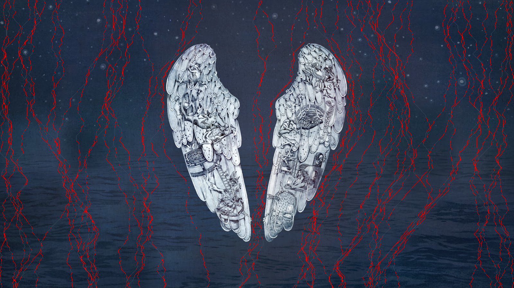

# Seam Carving

[![Build Status][travis-image]][travis-url]

## *Project Title* - Implementation of *Seam Carving* for image retargetting using CUDA enabled GPU

## Problem Definition

To implement **content-aware [Seam Carving Algorithm](https://en.wikipedia.org/wiki/Seam_carving)** of image processing (which is used by Adobe Photoshop) using a **sequential** and a **parallel** approach. The sequential implementation will be done on a CPU (Central processing units) and the parallel implementation will be done on a [CUDA (Compute unified device architecture)](https://en.wikipedia.org/wiki/CUDA) powered NVidia [GPU](https://en.wikipedia.org/wiki/Graphics_processing_unit). 

*The primary purpose of this demonstration is to show the difference between the computational speeds of a CPU and a GPU.* 

## Introduction

### What is Seam Carving?

From Wikipedia :

>**Seam carving is an algorithm for image resizing**, developed by Shai Avidan, of Mitsubishi
Electric Research Laboratories (MERL), and Ariel Shamir, of the Interdisciplinary Center and MERL. It
functions by establishing a number of seams (paths of least importance) in an image and **automatically
removes seams to reduce image size or inserts seams to extend it.** Seam carving also allows manually
defining areas in which pixels may not be modified, and **features the ability to remove whole objects from
photographs.** 
>
>*The purpose of the algorithm is to display images without distortion on various media (cell
phones, PDAs) using document standards, like HTML, that already support dynamic changes in page
layout and text, but not images.*

### What is a seam?

From Wikipedia :

>Seams can be either vertical or horizontal. **A vertical seam is a path of connected pixels from top
to bottom in an image with one pixel in each row.** A horizontal seam is similar with the exception of the
connection being from left to right. The importance/energy function values a pixel by measuring its
contrast with its neighbor pixels.

## Installation

## Hardware Requirements:

| | Component | Requirement |
|--|--|--|
|1.| Processor |  **Minimum Requirement:** Intel Pentium 4 or above/AMD Anthon processor range or above.|
| | | **Recommended Requirement:** Intel i3 2nd Generation or above/AMD Phoenix or above. |
|2.|Memory | **Minimum Requirements:** 100MB or above. |
| | | **Recommended Requirement:** 250MB or above. |
|3.|Hard disk space | **Minimum Requirement:** 120MB or above. |
| | | **Recommended Requirement:** 200MB or above. |
|4.|Others| CUDA enabled GPU's manufactured by NVIDIA present in PC's OR Laptops |

### Software Requirements:

| | Software | Requirement |
| -- | -- | -- |
| 1. | Operating System | Windows (XP and above) |
| 2. | environment | .NET 3.5 and up, visual c++ runtime environment. |
| 3. | CUDA runtime environment | Greater than v2.3 |

## Execution Instructions

1) Double click on the [**SeamCarving.exe**](https://github.com/kalpeshdusane/Seam-Carving-B.E.-Project/blob/master/Project%20exe/SeamCarving.exe).
2) Run the project.

This is the main interface of our application.
- The first textbox is to select the image path either by browsing or entering manually. 
- The second text box is for accepting the number of seams that are to be carved manually in the form of an integer number.

Then User can choose one of these three options :
- Curve Sequentially
- Draw Seams Parallely
- Curve Parallely

After pressing any key program shows the output of the algorithm.

## Results

Here we are using Coldplay's [Ghost Stories](https://en.wikipedia.org/wiki/Ghost_Stories_(Coldplay_album)) album cover image to show the results.

### Input image (1600x900)

### 50 Seams Highlighted

### Output Image after 1000 Seams Removed

The following table represent the execution timings in seconds for the above image of size 1600x900 pixels:

| No of seams | Sequential(CPU) | Parallel(GPU) |
|--|--|--|
| 50 | 43.596 | 7.091 |
| 100 | 72.394 | 11.603 |
| 200 | 161.998 | 20.652 |
| 500 | 345.105 | 44.819 |
| 1000 | 548.305 | 76.117 |

## Published Paper

- [ACCELERATED SEAM CARVING USING CUDA](https://ijret.org/volumes/2014v03/i10/IJRET20140310048.pdf)

## Contributers

-	Prathmesh
-	Kalpesh
-	Fardeen
- Swapnil

## References

- [Seam Carving for Content-Aware Image Resizing](https://dl.acm.org/citation.cfm?id=1276390) by Shai Avidan and Ariel Shamir
- [CUDASA: Compute Unified Device and Systems Architecture](https://dl.acm.org/citation.cfm?id=2386183) by M. Strengert, C. Müller, C. Dachsbacher, and T. Ertl 
- [Optimization of a single seam removal using a GPU](http://worldcomp-proceedings.com/proc/p2011/PDP3497.pdf) by Rok Cešnovar, Patricio Buliˇc, and Tomaž Dobravec
- [Fast JND-Based Video Carving with GPU Acceleration for Real-Time Video Retargeting](https://ieeexplore.ieee.org/document/5229299/) by Chen-Kuo Chiang, Shu-Fan Wang, Yi-Ling Chen, and Shang-Hong Lai
- [Run-time Image and Video Resizing Using CUDA-enabled GPUs](https://www.semanticscholar.org/paper/Run-time-Image-and-Video-Resizing-Using-GPUs-Duarte-Sendag/c3330696213035ed2d9818c44375cd68604e0a44) by Ronald Duarte and Resit Sendag

<!-- Markdown link & img dfn's -->
[travis-image]: https://img.shields.io/travis/dbader/node-datadog-metrics/master.svg?style=flat-square
[travis-url]: https://travis-ci.org/dbader/node-datadog-metrics

